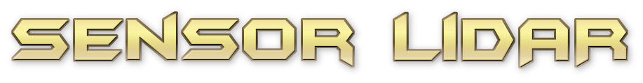
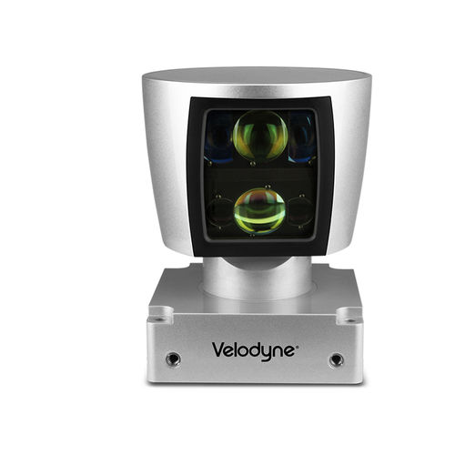
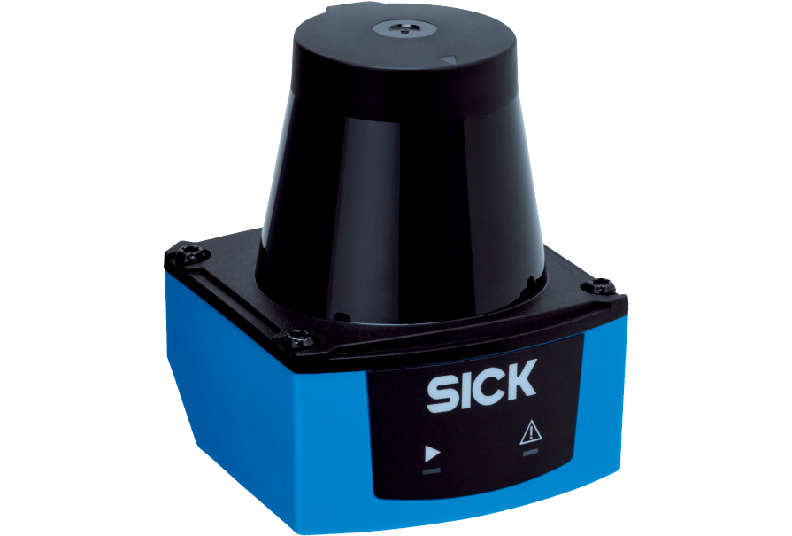
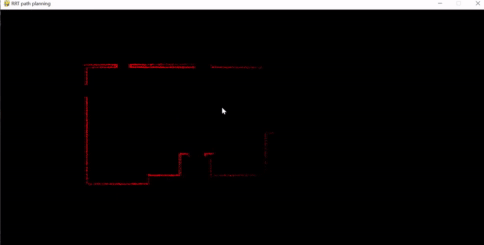
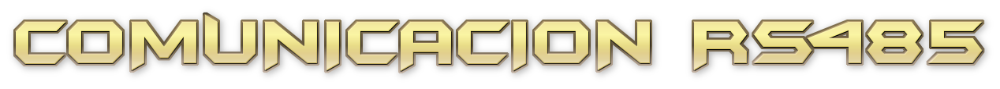
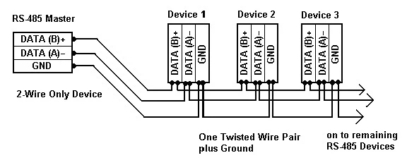

<div align="center">
<h1> Instituto Tecnologico de Tijuana 
<br>Exposicion: Sensor LIDAR Y RS485 comunicación de sensores
<br>Mondaca Medina Sofia Carolina
<br>18212226 </h1>
</div>



* Proviene del acronimo en ingles de **Li**ght **d**etection **a**nd **r**anging 
    * Significa "deteccion de luz y distancias"
    * Tambien es comunmente referido como "laser scanning" o "3D scanning"
* Es una tecnologia utilizada para medir la distancia extacta de un objeto en la superficie de la Tierra
    * Estas mediciones se realizan por medio de un laser pulsado que es seguro para la vista humana
* El sensor crea una representacion 3D del espacio escaneado en cuestion
* Es utilizado primariamente en la industria automotriz, infraestructura, robotica, cartografica, entre otras.
    * Actualmente son los sensores mas vitales para los autos que se conducen sin mano humana, es decir, los autos automaticos
* Su precio varia desde los 900$ MXN a 3000$ MXN
* Existen diversos modelos para un sensor LiDAR, he aqui algunos ejemplos:




<div></div>

# ¿Como funciona un sensor LiDAR?

<p>Un LiDAR consiste de un foco emisor de rayos laser infrarrojos y de un lente receptor infrarrojo capaz de ver los laser. Cuando los rayos laser impactan sobre un objeto, se reflejan** o **rebotan. Estas rayos que vuelven reflejados son detectados por el lente, y asi el procesador del sensor obtiene una nube de puntos del entorno en donde conoce la posicion precisa en el espacio y la distancia entre los puntos. Finalmente, procesa una imagen tridimensional en tiempo real.</p>

<div></div>

# ¿Como se compara un sensor LiDAR a una camara?

| **Sensor LiDAR**                                                                                 | **Sistema de camaras**                                              |
|--------------------------------------------------------------------------------------------------|---------------------------------------------------------------------|
| "Observa" en 3D a traves de mapas en 3D de alta resolucion dandole una gran ventaja en presicion | Producen imagenes 2D del ambiente a su alrededor                    |
| Produce medidas exactas                                                                          | Tienen que asumir la distancia de un objeto                         |
| Tiene su propia fuente de luz, por lo que puede "ver" en cualquier condicion luminosa            | Son dependientes de la iluminacion y otras condiciones del ambiente |

# Simulador del sensor con Python



**main.py**
```

import env, sensor
import pygame


environment = env.buildEnvironment((600,1200))
environment.originalMap = environment.map.copy()
laser = sensor.LaserSensor(200, environment.originalMap, uncertainty=(0.5,0.01))
environment.map.fill((0,0,0))
environment.infomap = environment.map.copy()

running = True

while running:
    sensorON = False
    for event in pygame.event.get():
        if event.type == pygame.QUIT:
            running=False
        if pygame.mouse.get_focused():
            sensorON = True
        elif not pygame.mouse.get_focused():
            sensorON = False
    if sensorON:
        position=pygame.mouse.get_pos()
        laser.position = position
        sensor_data = laser.sense_obstacles()
        environment.dataStorage(sensor_data)
        environment.show_sensorData()
    environment.map.blit(environment.infomap,(0,0))
    pygame.display.update()
```
**env.py**
```
import math
import pygame

class buildEnvironment:
    def __init__(self, MapDimentions):
        pygame.init()
        self.pointCloud = []
        self.externalMap=pygame.image.load('plano.png')
        self.maph, self.mapw = MapDimentions
        self.MapWindowName = 'RRT path planning'
        pygame.display.set_caption(self.MapWindowName)
        self.map = pygame.display.set_mode((self.mapw,self.maph))
        self.map.blit(self.externalMap,(0,0))

        self.black = (0,0,0)
        self.grey = (70,70,70)
        self.Blue = (0,0,255)
        self.Green = (0,255,0)
        self.Red = (255, 0, 0)
        self.white = (255, 255, 255)

    def AD2pos(self,distance,angle,robotPosition):
        x = distance * math.cos(angle)+robotPosition[0]
        y = -distance * math.sin(angle)+robotPosition[1]
        return (int(x),int(y))

    def dataStorage(self,data):
        print(len(self.pointCloud))
        if data!=False:
            for element in data:
                point = self.AD2pos(element[0].element[1],element[2])
                if point not in self.pointCloud:
                    self.pointCloud.append(point)

    def show_sensorData(self):
        self.infomap=self.map.copy()
        for point in self.pointCloud:
            self.infomap.set_at((int(point[0]),int(point[1])),(255,0,0))
 ```
 **sensor.py**
 ```
 import pygame
import math
import numpy as np

def uncertainty_add(distance,angle,sigma):
    mean = np.array([distance, angle])
    covariance= np.diag(sigma ** 2)
    distance, angle = np.random.multivariate_normal(mean, covariance)
    distance= max(distance,0)
    angle= max(angle,0)
    return [distance, angle]


class LaserSensor:
    def __init__(self, Range, map, uncertainty):
        self.Range = Range
        self.speed = 4
        self.sigma = np.array([uncertainty[0], uncertainty[1]])
        self.map = map
        self.position=(0,0)
        self.W, self.H = pygame.display.get_surface().get_size()
        self.sensedObstacles = []

    def distance(self, obstaclePosition):
        px =(obstaclePosition[0]-self.position[0])**2
        py = (obstaclePosition[1]-self.position[1])**2
        return math.sqrt(px+py)

    def sense_obstacles(self):
        data=[]
        x1,y1 = self.position[0], self.position[1]
        for angle in np.linspace(0,2*math.pi,60,False):
            x2,y2 = (x1 + self.Range * math.cos(angle), y1 - self.Range * math.sin(angle))
            for i in range(0,100):
                u = i/100
                x = int(x2*u + x1 * (1-u))
                y = int(y2 * u + y1 * (1-u))
                if 0<x<self.W and 0<y<self.H:
                    color=self.map.get_at((x,y))
                    if(color[0], color[1], color[2]) == (0,0,0):
                        distance=self.distance((x,y))
                        output = uncertainty_add(distance,angle,self.sigma)
                        output.append(self.position)

                        data.append(output)
                        break
        if len(data)>0:
            return data
        else:
            return False
```

**Plano real**

<div></div>



* Es un estandar de comunicaciones tambien conocido como **EIA/TIA-485**
* Su principal funcion es transportar una señal a traves de dos cables
    * Uno de los cables transmite la señal original
    * El otro su copia inversa
* Este metodo se conoce como "intercambio de datos bidireccional" y ofrece una gran resistencia a las interferencias en modo comun
* Sin embargo, los dispositivos RS-485 no pueden transmitir y recibir datos al mismo tiempo
    * Es necesario adoptar cierto comportamiento para evitar colision de paquetes de datos



<div></div>

# Caracteristicas y limitaciones del RS-485

* La longitud maxima del cable utilizado en comunicaciones RS-485 es de 1200 metros
* Es necesario que los dispositivos del sistema establezcan un formato comun para la transmision de los paquetes de datos
* Es generalmente utilizado en cables de partrenzados

<div></div>

# RS-485 vs RS-232

Los estandares RS-485 y RS-232 proporcionan soluciones para transmitir datos en largas distancias, sin embargo, las ampliaciones del RS-232 eventualmente dieron el nacimiento de RS-485, por lo que la siguiente tabla ofrece una comparacion entre los dos estandares.

| **Sensor LiDAR**                                                                                 | **Sistema de camaras**                                              |
|--------------------------------------------------------------------------------------------------|---------------------------------------------------------------------|
| "Observa" en 3D a traves de mapas en 3D de alta resolucion dandole una gran ventaja en presicion | Producen imagenes 2D del ambiente a su alrededor                    |
| Produce medidas exactas                                                                          | Tienen que asumir la distancia de un objeto                         |
| Tiene su propia fuente de luz, por lo que puede "ver" en cualquier condicion luminosa            | Son dependientes de la iluminacion y otras condiciones del ambiente |
